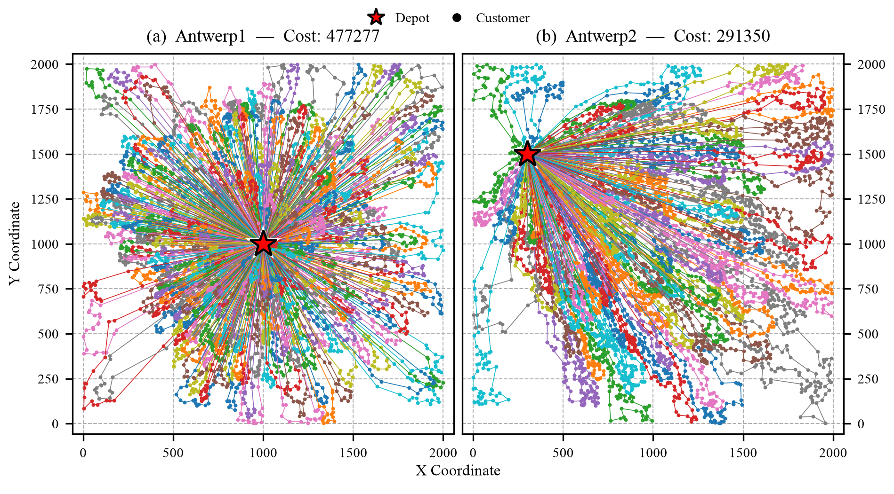
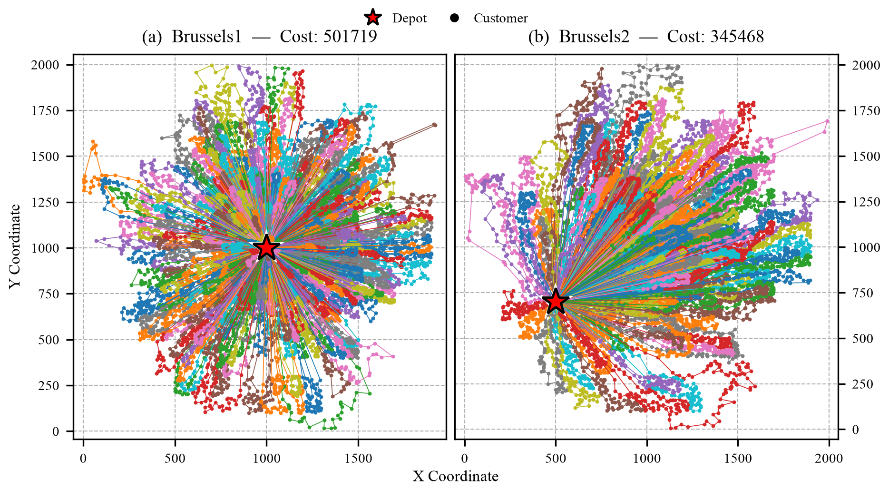

<h1 align="center">BP-MDS</h1>
<p align="center">
  <b>Bucket-Partitioned MDS: CVRP Solver</b><br/>
  Million-scale <b>Capacitated Vehicle Routing</b> — partition the plane, conquer in parallel.
</p>

<p align="center">
  
</p>

<p align="center">
  
  
  
  
</p>

<p align="center">
  <a href="#how-it-flows">Flow</a> ·
  <a href="#bks-routes-at-a-glance">Routes</a> ·
  <a href="#quick-start">Quick start</a> ·
  <a href="#platforms">Platforms</a> ·
  <a href="Inputs/README.md">310 instances</a> ·
  <a href="Results/README.md">Results</a>
</p>

---

### Why BP-MDS?

| | |
|:--|:--|
| **Angular buckets** | Depot-centered sectors (angle **α**) turn one huge CVRP into many smaller ones |
| **MDS core** | MST + **ρ** randomized DFS tours — simple, fast, parallel-friendly |
| **OpenMP** | Buckets (and DFS trials) run concurrently on multi-core nodes |
| **Million scale** | Built for synthetic & FILO2-sized instances, not only classic CVRPLIB toys |

---

## How it flows

The code follows this pipeline end-to-end (`Src/Main.cpp` → `Lib/Bucket_Partitioned_MDS/`):

```mermaid
flowchart LR
  A["`.vrp` instance"] --> B["Parse & init<br/>OpenMP"]
  B --> C["Angular partition<br/>α degrees"]
  C --> D["Per bucket<br/>construct MST"]
  D --> E["ρ × random DFS<br/>on the MST"]
  E --> F["Keep best routes<br/>per bucket"]
  F --> G["Merge · verify<br/>write `.sol`"]

  style A fill:#1a1a2e,stroke:#eee,color:#fff
  style C fill:#16213e,stroke:#0f3460,color:#fff
  style D fill:#0f3460,stroke:#533483,color:#fff
  style E fill:#533483,stroke:#e94560,color:#fff
  style G fill:#e94560,stroke:#fff,color:#fff
```

**In one line:** *partition → MST → diversify DFS → parallel reduce → solution.*

---

## BKS routes at a glance (🌼 like pattern)

<p align="center">
  
</p>
<p align="center">
  
</p>

<p align="center"><sub>Antwerp · Brussels — more under <code>Results/BKSPlots/combined/</code></sub></p>

Regenerate figures:

```bash
bash Scripts/BKSPlotsGenerator/run_bks_plots.sh --pdf --html
```

---

## Platforms

| Platform | Status | Notes |
|:---------|:-------|:------|
| **Linux** | ✅ Primary | Cluster target. OpenMP + memory stats work as designed |
| **macOS** | ✅ Local OK | `make CXX=g++-15` (Homebrew GCC). Solve works; `/proc` warning is harmless; **MB in `.sol` unreliable** |
| **Windows** | ❌ Native | Use **WSL** (Ubuntu) and follow Linux steps |

---

## Quick start

```bash
# Build  (macOS: make CXX=g++-15)
make

# Solve the toy sample
mkdir -p Results/Output/Sample
./Bin/bucket-partitioned-MDS \
  --alpha=30 \
  --rho=100 \
  --input=Inputs/Sample/toy.vrp \
  --output=Results/Output/Sample/toy.sol
```

| Flag | Role |
|:-----|:-----|
| `--alpha` | Partition angle in degrees (`0 < α ≤ 360`) |
| `--rho` | Randomized DFS iterations per bucket |
| `--input` | Path to a `.vrp` file |
| `--output` | Where to write the `.sol` |

Full benchmark catalog (**310** instances: CVRPLIB · FILO2 · Synthetic) → [`Inputs/README.md`](Inputs/README.md)  
Large `.vrp` sets ship as **GitHub Release** zips (folders are gitignored).

---

## Repository map

```text
BP-MDS/
├── Src/Main.cpp                 # CLI → solve → verify → print
├── Include/ · Lib/              # Solver, CVRP I/O, utils, OpenMP init
├── Inputs/                      # Sample + catalog (CSV / README)
├── Results/                     # Figures, experimental eval, outputs
├── Scripts/                     # Plots & tooling
└── Makefile                     # → Bin/bucket-partitioned-MDS
```

Ablation variants (set / non-lazy DFS / BFS / buckets) live under  
`Results/ExperimentalEvaluation/Code/` and **BPMDS_Scripts** — not this Makefile.

---

## Dive deeper

| | |
|:--|:--|
| Instance index & BKS | [`Inputs/README.md`](Inputs/README.md) |
| Per-instance results & gaps | [`Results/README.md`](Results/README.md) |
| Route plot pipeline | [`Scripts/BKSPlotsGenerator/`](Scripts/BKSPlotsGenerator/) |
| Sweep / scaling scripts | [`Scripts/`](Scripts/) |

---

<p align="center">
  <i>Partition hard. Search light. Scale far.</i>
</p>
