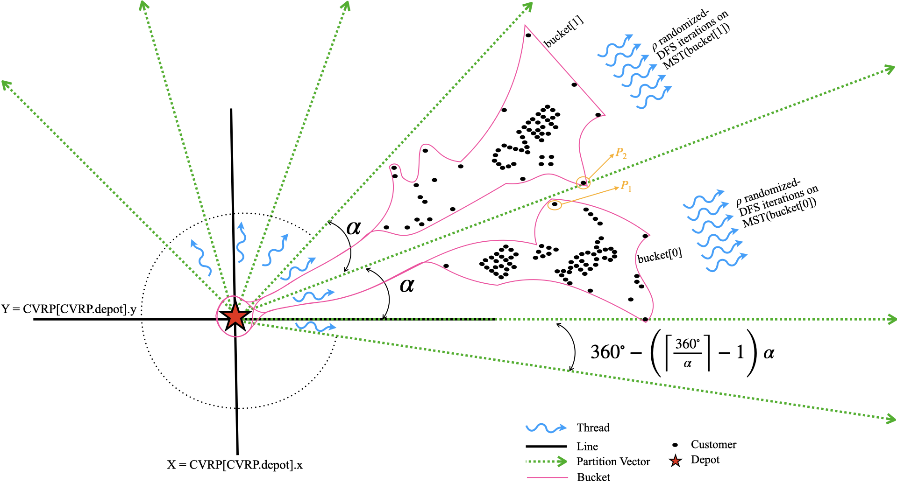

# BP-MDS



**Bucket-Partitioned Minimum-Degree Search** — a fast, parallel heuristic for the Capacitated Vehicle Routing Problem (CVRP).

Customers around the depot are split into angular **buckets** (angle $\alpha$). Each bucket builds an MST and explores $\rho$ randomized DFS orderings — in parallel with OpenMP.

---

## Quick start

```bash
# Build (needs C++17 + OpenMP)
make

# Run
./Bin/bucket-partitioned-MDS \
  --alpha=30 \
  --rho=100 \
  --input=Inputs/Sample/toy.vrp \
  --output=solution.sol
```

Benchmarks & parameter sweeps: see [`Scripts/`](Scripts/) (`python3 Scripts/test_pipeline.py`).

---

## Project structure

```text
BP-MDS/
├── Src/                 # Entry point (Main.cpp)
├── Include/             # Public headers
├── Lib/                 # Core implementation
│   ├── Bucket_Partitioned_MDS/   # CVRP, Solver, Solution
│   └── Utils/                    # Heap, geometry, memory
├── Inputs/              # CVRP instances (.vrp) — see Inputs/README.md
├── Results/             # Figures & experiment artifacts
├── Scripts/             # Build / benchmark / plotting pipeline
├── Bin/                 # Built executables (gitignored)
└── Makefile
```

| Path | Purpose |
|:-----|:--------|
| `Src/` | Program entry |
| `Lib/` | Algorithm & utilities |
| `Include/` | Headers |
| `Inputs/` | Benchmarks (CVRPLIB, FILO2, Synthetic) |
| `Results/` | Figures / outputs for the paper |
| `Scripts/` | Automation (`test_pipeline.py`, generators) |

---

## Instance sizes

| Class | #Customers |
|:-----:|-----------:|
| XS | 1 – 100 |
| S | 101 – 1,000 |
| M | 1,001 – 10,000 |
| L | 10,001 – 50,000 |
| XL | 50,001 – 100,000 |
| XXL | 100,001 – 1,000,000 |
| XXXL | 1,000,001 – 10,000,000 |

Full instance list: [`Inputs/README.md`](Inputs/README.md) · index: [`Inputs/instances.csv`](Inputs/instances.csv)

---

## Requirements

- **C++17** compiler with **OpenMP**
- **Python 3** (for `Scripts/` pipeline only)

---

## License

See repository for license details.
